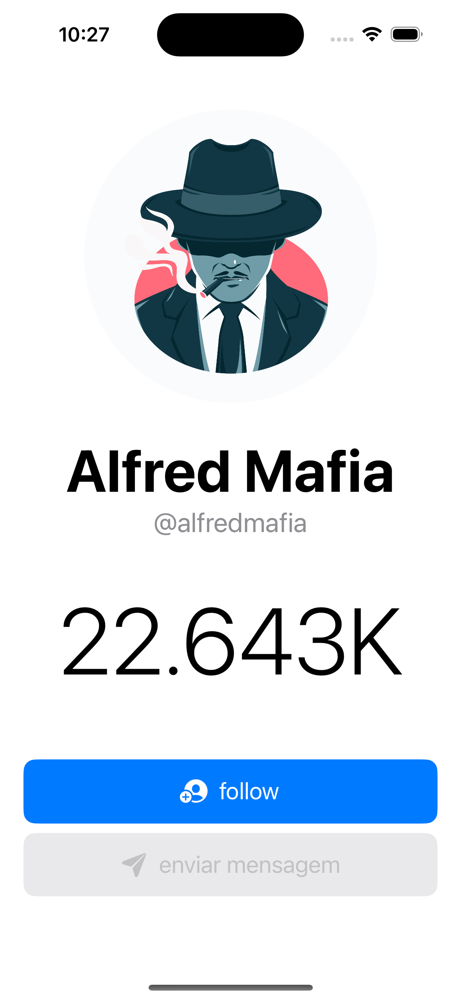
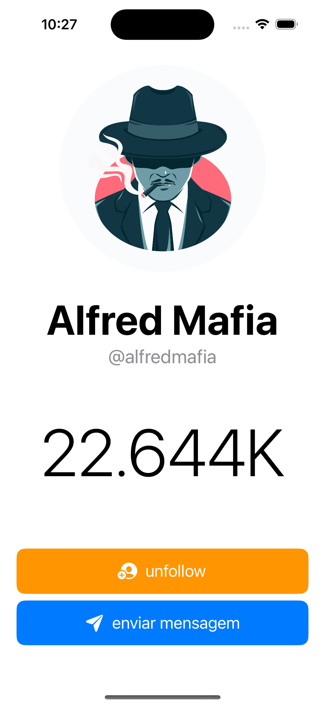

# MyApp


MyApp is a [SwiftUI](https://developer.apple.com/xcode/swiftui/) application built using the [MVVM](https://en.wikipedia.org/wiki/Model%E2%80%93view%E2%80%93viewmodel) (Model-View-ViewModel) architectural pattern. The project is designed to demonstrate the usage of SwiftUI combined with MVVM to create a clean, maintainable, and scalable codebase.

## Features

- **Modern UI**: Uses SwiftUI to build a responsive and dynamic user interface.
- **MVVM Architecture**: Separation of concerns to improve testability and maintainability.
- **Reactive Programming**: Uses Combine to handle data binding and asynchronous tasks.
- **Modular Design**: Easily extendable and adaptable to new features.

## Screenshots

| Unfollow    | Follow |
| -------- | ------- |
|   |  |

## Requirements

- iOS 14.0+
- Xcode 15.0+
- Swift 5.3+

## Installation

### Clone the Repository

```bash
git clone https://github.com/yourusername/MyApp.git
cd MyApp
